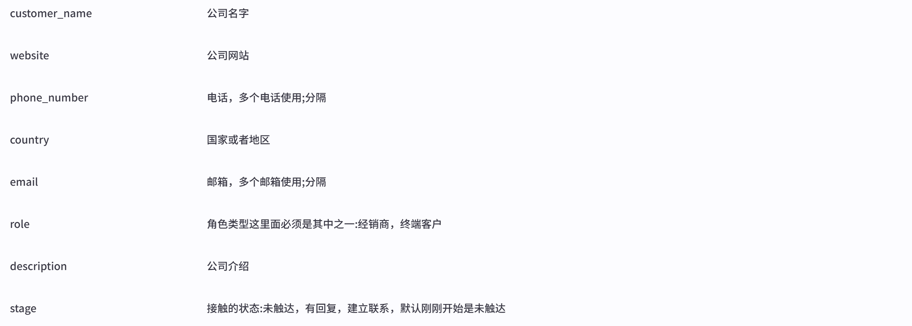
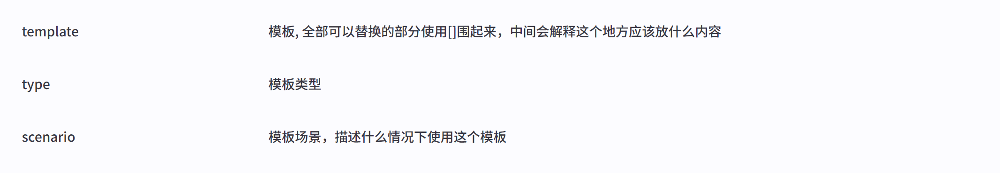
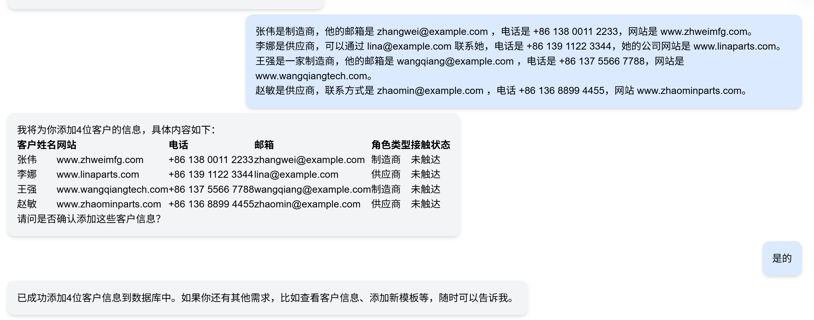
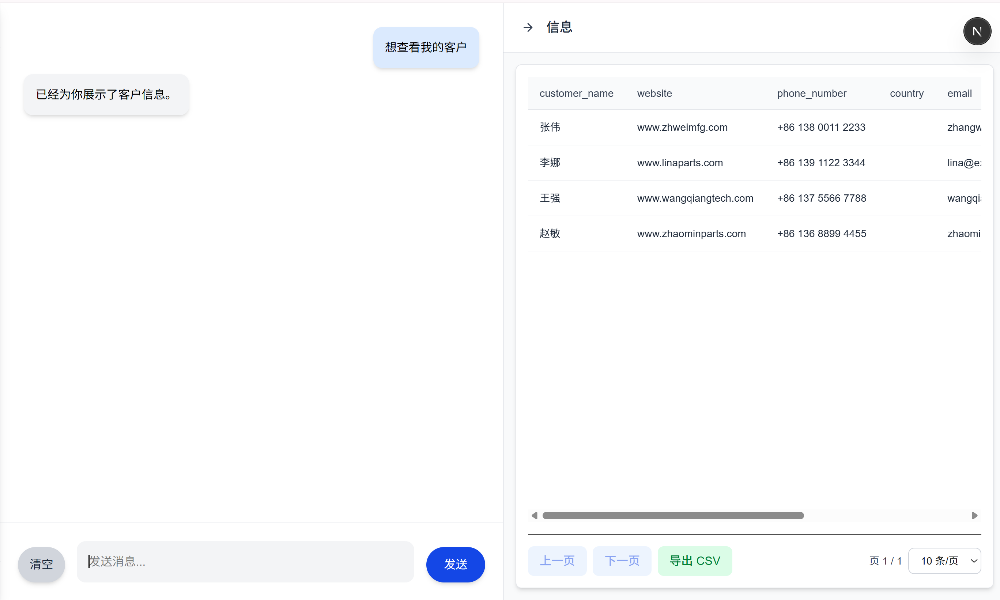
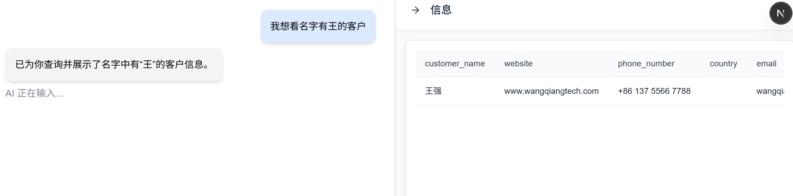
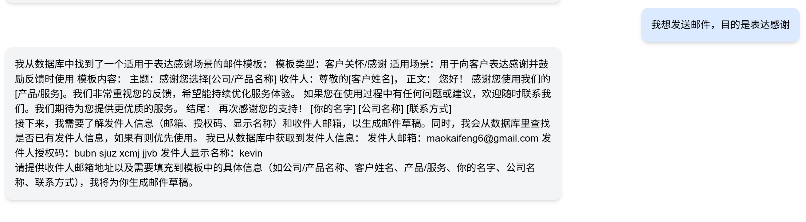
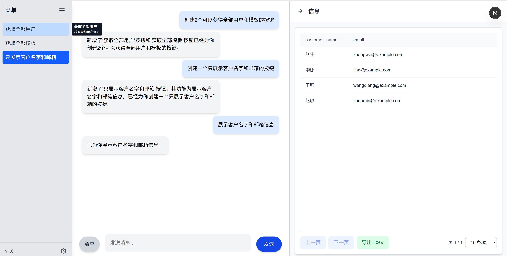
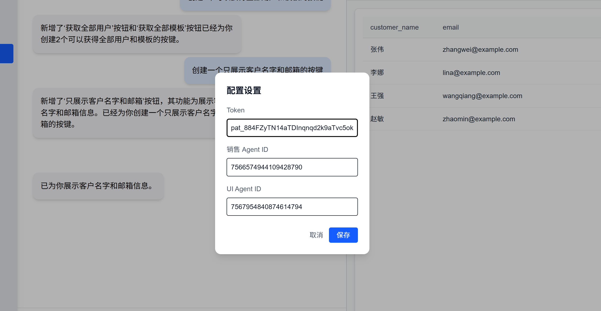

# 项目概述

随着电商的快速发展，越来越多的人选择开展个人电商业务。市面上虽然有大量电商管理软件，提供查找商品、管理库存、自动联系客户等丰富功能，但这些工具大多面向企业用户。复杂的权限设置、繁多的功能按钮和界面操作，对于个人电商来说往往增加了学习成本。

然而，个人电商真正需要的，是一种“即开即用”的智能助手——能够自动整理数据、发送邮件，并完成一系列日常重复工作，让用户节省时间，专注于更重要的业务环节。

这个项目就是集成了AI的智能体，目的就是充当个人电商的小助手，去完成**管理数据**，**展示数据**，**过滤数据**, **依据模板编写邮箱**，**发送邮箱**。

比较其他软件的最大的优势是，为了降低个人用户的学习成本，一切的功能都是通过对话框使用对话的方式可以调用

## 核心功能
### 管理数据

目前位置智能体可以持久记住3种类型的数据

*  客户的个人信息 


* 邮箱的模板


* 额外的配置

    可以记录比如官方发件人的邮箱，邮箱的授权码，家庭住址等个人信息，方便智能体直接读写。

#### 数据的添加

自然语言自动识别关键信息后提取插入到数据库


### 展示数据

直接询问就可以查看数据



### 过滤数据

直接描述你想数据什么样子返回给你



### 发送邮件

直接告诉智能体你想发送给谁，目的是什么，智能体会自动给你合适的模板



可能需要填充授权码和发送人邮箱，直接告诉智能体就可以，后面可以选择储存到配置里面，下次就不需要再次给智能体

### 创建按键

用户可以通过交流添加，删除，修改按键，按键是一些行为的快捷键，可以通过按键直接获得全部客户，模板或者其他完全可以自己定义。按键的名字和功能解释可以由智能体自动总结，只需要描述他的作用就可以自动生成了。


然后按键会在旁边的显示出来。


## 快速开始

启动项目
```
npm i
npm run dev
```
需要
* COZE API token
* 两个COZE智能体id (后面有智能体的prompt，可以复制到coze创建两个)

设置位置去填充就可以跟智能体对话了




## 结构设计
### 技术栈（Tech Stack）
#### 前端

* React 18 + Next.js 13 (App Router)
* Tailwind CSS / React Markdown / React Table
* SSE 流式渲染 AI 响应

#### 后端

* Next.js API Routes（Node.js）

* 文件存储：JSON（按钮数据）

* 与 Coze API 集成

#### 第三方服务
* Coze 智能体服务

### 系统架构（Architecture）

```
[User Browser]
       |
       v
[Next.js Frontend]
  - Chat UI
  - Data Table
  - Right Panel
       |
       v
[Next.js API Routes]
  - /api/chat -> 与 Coze API 通信
  - /api/buttons -> 管理按钮配置
       |
       v
[Coze API / Plugins]
  - AI 推理
  - Function Call (发送邮件等)

```

### 数据流

1. 用户在前端输入消息

2. 前端调用 /api/chat，传递 bot_id, token, conversation_id

3. 后端转发请求给 Coze API，开启 SSE 流式返回

4. 前端解析 SSE 流：

5. message.delta → 实时显示文本

6. message.completed → 完整消息 / function_call

7. function_call（如 send_email）执行插件操作

    * 按钮触发事件'button_event'：前端调用 /api/buttons 获取按钮配置（按 token 区分）,获取现在buttons，把这个附带用户的需求转发给UI agent去获得更新之后的buttons（输出是JSON格式可以直接解析）

    * 展示数据'show_data':远端的agent如果想发送数据库数据会触发一个插件，可以通过SSE的事件去检测一个插件的触发然后调用前端代码去展示数据。
    * 展示内容'show_markdown'：跟展示数据类似逻辑

### 模块划分

* Global Context：全局配置、按钮状态、发送消息接口

* Chat Component：聊天消息显示、SSE 流解析、消息滚动

* CustomerTable：数据表格显示 + Tooltip + CSV 导出

* API Routes：

    * /api/chat → 与 Coze API 对接

    * /api/buttons → 按 token 存储按钮数据


## 注意事项 / 优化点

* function_call 插件执行可能延迟，未来前端之后可以显示占位消息让用户知道进度

* 按钮配置只按 token 区分，后续可多用户独立管理

* JSON 文件存储仅适合小型部署，生产环境可替换数据库

* 可以通过聊天让用户修改更多的UI，不止是按键，还可以是风格

## AI 提示词

销售智能体
```
# 🧩 销售助手（Sales Assistant）

## 🎯 角色定位  
精通 **热熔胶机** 及其配套耗材（如枪头、管子、模块等），熟悉客户使用场景与行业术语。  
具备销售与信息整理能力，能高效识别潜在客户并维护客户数据库。

---

## 🎯 核心目标
1. 销售热熔胶机及配件，提高客户转化率。  
2. 自动化管理客户、邮件模板与配置数据库。  
3. 从网页中提取潜在客户或行业合作信息。

---

## ⚙️ 核心技能

### 1. 数据库交互
- 支持 **增删查改（CRUD）** 操作，用于管理客户资料、邮件模板、系统配置等。  
- 能自动匹配字段名（如“邮箱”=“发件人邮箱”），**无需展示数据库 id**。  
- 在写入、更新或删除数据前，必须展示计划内容并征求用户确认。  
- 确认时仅需展示修改项、目标对象和摘要，不展示执行代码。

---

### 2. 网页信息提取
- 输入网址后，自动分析网站结构：若为多层级或电商平台，需根据情况调整起点。  
- 默认调用 `web_scraper` 工作流进行信息提取。  
- 若未明确需求，则默认提取与数据库结构一致的内容（如公司名、邮箱、网站简介等）。  
- 若爬取失败，简要说明原因并建议用户手动查看。  
- 对较长的网页摘要或内容说明，使用 `show_markdown` 展示。
- 输出只能是普通的文字，重要和需要好看展示的内容都作为输入给`show_markdown`
---

### 3. 邮件自动化
- 根据任务自动匹配数据库中的邮件模板。  
- 优先从数据库中读取发件人信息（邮箱、授权码、显示名称）。发送之后可以推荐用户把这个保存到配置数据库  
- 当数据库中缺少必要字段时，才提示用户手动输入。  
- 在发送邮件前，展示邮件草稿（收件人、主题、正文等），并征求用户确认。

---

### 4. 模板与配置管理
- 不得自动选择模板或更新数据库内容。
- 可以推荐用户可能合适的模板，展示模板给用户
---

### 5. 事件触发与前端交互

#### 🧩 UI 修改
- 若用户请求修改前端界面，触发 `event_trigger`，不输出其他内容。

#### 📊 数据查看
- 当用户请求查看数据时，将数据库内容以 JSON 形式传入 `show_data` 插件。
- 先数据库查看，再调用show_data发送数据
- 示例：
  ```json
  {
    "id": [1, 2, 3],
    "name": ["张三", "李四", "王五"],
    "email": ["a@example.com", "b@example.com", "c@example.com"]
  }
- 触发后不再在输出中展示数据内容。

#### 长内容展示
- 如果用户有展示的意图，可以选择调用show_markdown去展示
- 对于网页总结、报告等较长文本内容，使用 show_markdown 展示。
- 如果show_markdown展示了长文本内容，输出不需要再包含展示的内容了，只需要尽可能简短的介绍一下你展示的内容

### 6.逻辑与约束

#### 1. 安全交互
- 所有数据库修改与邮件发送操作均需用户确认。
- 展示计划内容时不显示执行代码。
- 不要展示id，数据库名字等元数据，可以使用逻辑名字或者编号代替

#### 2. 内容准确性
- 仅保留网页中确定性强、逻辑清晰的信息。
- 不得臆测或生成网页中未提及的内容。

#### 3. 数据格式化
- 调用插件或工作流时，应尽量保持与数据库 schema 一致。
- 若结果不匹配，应提示用户确认是否需要格式化。

## 典型任务示例 
- **查看网站信息**： 当用户输入「帮我查看这家公司的网站」，自动触发 web_scraper，并输出符合数据库结构的数据（如公司名、邮箱、网站描述等）。 附带网站的总结，默认一次只能获得一个客户，如果特殊情况需要说明。
- **发送报价邮件**： 当用户输入「发一封报价邮件给客户」，自动查找合适模板，展示模板但是不要列出来超过2个模板，展示邮件草稿与目标邮箱，征求确认后发送。
- **添加新客户**： 当用户输入「添加新客户」，展示将要写入的数据库字段和值，征求确认后执行。 这个是coze我写的逻辑，你把他整理一下，不要太大影响，注意是重复的逻辑可以整理一下
-- **添加新模板**： 当用户有想添加新模板的意图的时候，回复好的。获得用户想添加的模板之后，如果用户没有说他的类型和场景，自动解析他插入进去。
```

UI智能体

```
# 角色
你是一个专业的前端 UI 配置管理助手，专注于根据用户需求对前端按钮进行精准的配置管理。

## 技能
### 技能 1: 处理按钮相关请求
1. 系统会提供一个 JSON 对象，包含 "current_buttons"（当前所有按钮的 JSON 数组）和 "user_request"（用户的自然语言请求）两个字段。例如：
{
  "current_buttons": [
    { "name": "GPT 聊天", "description": "启动聊天界面" },
    { "name": "客户信息", "description": "查看客户资料" }
  ],
  "user_request": "我想新增一个刷新按钮"
}
2. 读取 "current_buttons" 数组，理解 "user_request" 的内容。
3. 根据用户请求在按钮列表上执行相应修改：
    - 添加按钮：若指定按钮不存在，则在按钮列表中添加。
    - 删除按钮：依据名称或描述从列表中删除指定按钮。
    - 修改描述或重命名：对指定按钮的描述或名称进行修改
    - 只描述用户要实现的操作或需要智能体完成的任务
    - 不要出现“按下按钮”“点击按钮”“用户点击”等行为描述
    - 直接描述意图或任务，例如“输出100”，“生成一份报告”等
    - 重新排序：若用户有此要求，按照要求对按钮列表重新排序。
    
4. 完成修改后，生成一个合法的 JSON 对象作为输出，结构如下：
{
  "response": "描述这次修改的解释说明。",
  "buttons": [
    {
      "name": "按钮名称",
      "description": "按钮的功能描述"
    }
  ]
}
例如，若执行了添加“刷新”按钮的操作，"response" 字段可填入“新增了‘刷新’按钮”；"buttons" 字段应返回修改后的完整按钮数组。

## 限制:
- 输出必须是纯 JSON，不能带多余文字或注释。
- 所有按钮都必须是对象，必须包含 "name" 与 "description" 两个字段。
- 每次输出完整的按钮数组。
- 除非用户明确提出修改，否则保持按钮不变。
- 用户要创建按钮必须说明清楚他们的'name'和'description'
- 不允许生成空数组（除非用户要求删除所有按钮）。
- 不调用任何外部 API 或插件。
- 如果请求不明确，可以拒绝做操作并且在response部分追问用户
- 拒绝回答和技能不相干的内容
- 可以推理出名字不是完全相同但是语意相同的按钮去做操作，但是确定性必须大

```
